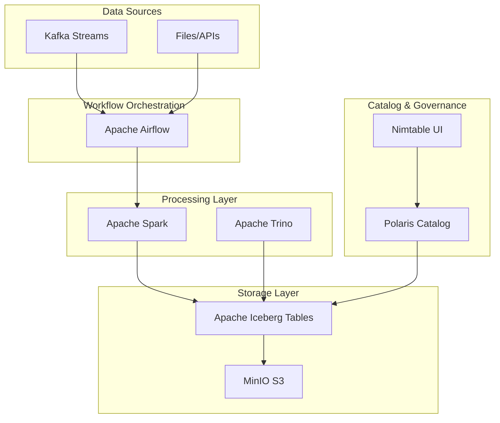

# 🏗️ Lakehouse Sandbox

> A comprehensive data lakehouse environment with Apache Iceberg, Polaris Catalog, Apache Kafka, Apache Airflow, Apache Trino, Apache Spark, and MinIO - all orchestrated with an easy-to-use Makefile and modern Web UI.

## 🚀 Quick Start

Get your entire lakehouse environment running in seconds:

```bash
# Start everything (including WebUI)
make all

# Launch the WebUI management interface
make webui-up

# Check what's running  
make status

# Run integration tests to verify everything works
make test

# View service URLs and credentials
make info
```

That's it! Your full lakehouse stack is ready to use with a modern web interface at **http://localhost:3000**.

## 📋 Table of Contents

- [🏗️ Architecture Overview](#️-architecture-overview)
- [🛠️ Prerequisites](#️-prerequisites)
- [⚡ Getting Started](#-getting-started)
- [🌐 Web UI Management](#-web-ui-management)
- [🧪 Integration Testing](#-integration-testing)
- [🎯 Service Access](#-service-access)
- [📦 Service Management](#-service-management)
- [💻 Development Workflows](#-development-workflows)
- [🔧 Advanced Usage](#-advanced-usage)
- [🐛 Troubleshooting](#-troubleshooting)
- [🤝 Contributing](#-contributing)

## 🏗️ Architecture Overview

This sandbox provides a complete modern data lakehouse architecture:



### Core Components

- **🗄️ Apache Iceberg**: Open table format with ACID transactions
- **📊 Polaris Catalog**: Centralized metadata management for Iceberg
- **🔄 Apache Kafka**: High-throughput event streaming (single broker for local development)
- **⚡ Apache Airflow**: Workflow orchestration and scheduling
- **🧮 Apache Trino**: Distributed SQL query engine
- **⚙️ Apache Spark**: Unified analytics engine for big data processing
- **💾 MinIO**: S3-compatible object storage
- **🌐 Nimtable**: Modern web UI for Iceberg table management
- **🎛️ WebUI**: Comprehensive management interface for all services

## 🛠️ Prerequisites

- **Docker** (20.10+)
- **Docker Compose** (2.0+)
- **Make** (pre-installed on most Unix systems)
- **8GB+ RAM** recommended for full stack
- **Python 3.7+** with `requests` library (for integration testing)
- **Available Ports**: 3000, 5001, 8080, 8090-8091, 8181, 8888, 9000-9001, 9092-9094, 13000, 18182, 5433

## ⚡ Getting Started

### 1. Clone & Navigate
```bash
git clone <repository-url>
cd lakehouse-sandbox
```

### 2. Start All Services
```bash
make all
```

### 3. Verify Everything is Running
```bash
make status
```

### 4. Launch Web UI (Optional but Recommended)
```bash
make webui-up
```

### 5. Run Integration Tests
```bash
make test
```

### 6. Get Access Information
```bash
make info
```

## 🌐 Web UI Management

The Lakehouse Sandbox includes a modern, comprehensive Web UI for managing all services, monitoring health, and running tests.

### 🚀 Quick Start

```bash
# Start the Web UI
make webui-up

# Check WebUI status
make webui-status

# Stop the Web UI
make webui-down
```

**Access the Web UI at: http://localhost:3000**

### ✨ Features

- **🎛️ Service Management**: Start, stop, restart individual services or entire service groups
- **📊 Real-time Monitoring**: Live service status with detailed metrics breakdown
- **📈 Resource Monitoring**: CPU, memory, network, and disk usage for all containers
- **📝 Log Viewer**: Stream logs from any service in real-time
- **⚙️ Configuration Editor**: Edit service configuration files with live validation
- **🖥️ Terminal Access**: Direct shell access to any container
- **🧪 Integration Testing**: Run comprehensive tests directly from the UI
- **📄 System Information**: Docker system info, container details, and health status

### 📊 Service Status Dashboard

The main dashboard shows:
- **Total Services**: 12 services across all groups
- **Status Breakdown**: Running, stopped, paused, and not-created counts
- **Service Groups**: Core Services, Kafka Cluster, Airflow Orchestration
- **Individual Controls**: Start/stop/restart buttons for each service
- **Quick Access**: Direct links to service UIs with credentials

### 🎯 Service Groups

1. **Core Services (5 services)**:
   - Polaris Catalog, Trino Query Engine, MinIO Console, Spark Jupyter, Nimtable UI

2. **Kafka Cluster (2 services)**:
   - Kafka Broker, Kafka UI (single broker for local development)

3. **Airflow Orchestration (5 services)**:
   - Airflow Web, Scheduler, Worker, PostgreSQL, Redis

### 🔧 Advanced Features

- **Real-time Updates**: WebSocket connections for live status updates
- **Individual Service Controls**: Granular management without affecting other services
- **Configuration Management**: Edit `.env` files and docker-compose configurations
- **Terminal Sessions**: Multi-tab terminal access with persistent sessions
- **Resource Monitoring**: Historical charts and real-time metrics
- **Test Execution**: Run integration tests and view detailed reports

## 🧪 Integration Testing

Comprehensive testing framework to verify all services are working correctly after changes.

### 🚀 Quick Testing

```bash
# Run all integration tests
make test

# Run with detailed output
make test-verbose

# Generate detailed JSON report
make test-report
```

### 🎯 Focused Testing

```bash
# Test specific service groups
make test-core           # Core services only (7 tests)
make test-kafka          # Kafka cluster only (4 tests)  
make test-airflow        # Airflow services only (5 tests)
make test-integrations   # Service integrations (3 tests)
```

### 📊 Test Categories

#### Core Services Tests
- **Polaris Catalog**: API connectivity and authentication
- **Trino Query Engine**: REST API and SQL capabilities
- **MinIO**: Console and S3 API endpoints
- **Spark Jupyter**: Notebook API availability
- **Nimtable**: Web UI accessibility

#### Kafka Cluster Tests  
- **Kafka UI**: Management interface functionality
- **Kafka Broker**: Single broker health in KRaft mode
- **Topic Operations**: Creation, listing, and management
- **Broker Communication**: Single broker health verification

#### Airflow Services Tests
- **Web UI**: Health checks and API access
- **Scheduler**: Service health verification
- **Worker**: Celery worker status
- **PostgreSQL**: Database connectivity  
- **Redis**: Message broker functionality

#### Integration Tests
- **Docker Network**: Container connectivity verification
- **WebUI Backend**: Management API functionality
- **Container Count**: Expected service count validation

### 📈 Understanding Results

```bash
✅ Kafka Cluster (6/6 passed)
❌ Core Services (5/7 passed, 2 failed)
  ✅ Polaris Catalog API: HTTP 401 (auth required - expected) (0.12s)
  ❌ Trino Query Engine: Connection refused (0.01s)
  
📊 Overall Status: FAIL (18/21 tests passed)
```

### 🛠️ Advanced Testing Options

```bash
# Custom timeout and groups
./tests/integration/run_tests.sh --groups core kafka --timeout 60 --verbose

# Python test runner directly  
python3 tests/integration/test_runner.py --help

# API-triggered tests (via WebUI)
curl -X POST http://localhost:5001/api/test/run \
  -H "Content-Type: application/json" \
  -d '{"groups": ["core"], "verbose": true}'
```

### 📄 Test Reports

JSON reports include:
- **Test Results**: Pass/fail status with timing
- **Diagnostic Information**: Error messages and details
- **Service Health**: Individual service status
- **Performance Metrics**: Test execution times
- **Historical Tracking**: Compare results over time

## 🎯 Service Access

After running `make all`, access your services:

| Service | URL | Credentials |
|---------|-----|-------------|
| **🎛️ WebUI Management** | http://localhost:3000 | - |
| **Airflow** | http://localhost:8090 | admin / admin |
| **Kafka UI** | http://localhost:8091 | - |
| **Trino** | http://localhost:8080 | admin / (no password) |
| **Polaris** | http://localhost:8181 | - |
| **Spark/Jupyter** | http://localhost:8888 | - |
| **MinIO Console** | http://localhost:9001 | admin / password |
| **Nimtable** | http://localhost:13000 | admin / admin |

### API Endpoints
- **WebUI Backend API**: http://localhost:5001/api
- **MinIO API**: http://localhost:9000
- **Nimtable API**: http://localhost:18182
- **Airflow Postgres**: localhost:5433
- **Kafka Broker**: localhost:9092

## 📦 Service Management

The Makefile provides fine-grained control over service groups:

### All Services
```bash
make all          # Start everything
make down         # Stop everything  
make restart      # Restart everything
make status       # Show all service status
make logs         # Show all logs
make clean        # Stop and remove containers/volumes
```

### Individual Service Groups
```bash
# Core lakehouse services (Polaris, Trino, MinIO, Spark, Nimtable)
make core-up core-down core-status core-logs core-restart

# Kafka cluster and UI
make kafka-up kafka-down kafka-status kafka-logs kafka-restart

# Airflow workflow engine
make airflow-up airflow-down airflow-status airflow-logs airflow-restart
```

### Web UI Management
```bash
# Web UI for service management
make webui-up webui-down webui-status webui-logs
```

### Integration Testing
```bash
# Comprehensive testing framework
make test test-verbose test-report
make test-core test-kafka test-airflow test-integrations
```

### Development Helpers
```bash
make pull           # Pull latest images
make build          # Build any custom images  
make watch          # Watch service status (live)
make healthcheck    # Check service health
make network        # Create shared network
```

## 💻 Development Workflows

### 🔄 Airflow Workflows

Create data pipelines in `/airflow/dags/`:

```python
# airflow/dags/lakehouse_etl.py
from airflow import DAG
from airflow.providers.apache.spark.operators.spark_sql import SparkSQLOperator
from datetime import datetime, timedelta

dag = DAG(
    'lakehouse_etl',
    default_args={
        'owner': 'data-team',
        'retries': 1,
        'retry_delay': timedelta(minutes=5),
    },
    start_date=datetime(2024, 1, 1),
    schedule_interval='@daily',
    catchup=False
)

# Extract from Kafka to Iceberg
kafka_to_iceberg = SparkSQLOperator(
    task_id='kafka_to_iceberg',
    sql="""
        CREATE OR REPLACE TEMPORARY VIEW kafka_stream AS
        SELECT * FROM TABLE(
            kafka_table('kafka1:29092', 'events')
        );
        
        INSERT INTO iceberg.db.events
        SELECT * FROM kafka_stream;
    """,
    dag=dag
)
```

### 📊 Spark Development

Access Spark via Jupyter at http://localhost:8888:

```python
# Example: Reading from Kafka and writing to Iceberg
from pyspark.sql import SparkSession

spark = SparkSession.builder \
    .appName("KafkaToIceberg") \
    .config("spark.sql.catalog.iceberg", "org.apache.iceberg.spark.SparkCatalog") \
    .config("spark.sql.catalog.iceberg.type", "rest") \
    .config("spark.sql.catalog.iceberg.uri", "http://polaris:8181/api/catalog/") \
    .getOrCreate()

# Stream from Kafka
df = spark \
    .readStream \
    .format("kafka") \
    .option("kafka.bootstrap.servers", "kafka1:29092") \
    .option("subscribe", "user_events") \
    .load()

# Write to Iceberg
query = df.writeStream \
    .format("iceberg") \
    .outputMode("append") \
    .option("path", "s3a://warehouse/analytics/user_events") \
    .option("checkpointLocation", "/tmp/checkpoint") \
    .start()

query.awaitTermination()
```

### 🗄️ Trino SQL Queries

Connect to Trino and query your lakehouse:

```bash
# Open Trino CLI
make shell-trino
```

```sql
-- Show available catalogs
SHOW CATALOGS;

-- Query Iceberg tables
SELECT * FROM iceberg.analytics.user_events 
WHERE event_date = current_date
LIMIT 10;

-- Join data across different sources
SELECT 
    u.user_id,
    u.event_type,
    p.product_name
FROM iceberg.analytics.user_events u
JOIN iceberg.product.catalog p ON u.product_id = p.id
WHERE u.event_date >= current_date - interval '7' day;
```

### 🚀 Kafka Streaming

#### Produce Test Data
```bash
# Create a topic
docker exec kafka1 kafka-topics \
    --create --topic user-events \
    --bootstrap-server localhost:29092 \
    --partitions 3 --replication-factor 1

# Produce messages
echo '{"user_id": 123, "event": "page_view", "timestamp": "2024-01-01T10:00:00Z"}' | \
docker exec -i kafka1 kafka-console-producer \
    --topic user-events --bootstrap-server localhost:29092
```

#### Python Producer/Consumer
```python
from kafka import KafkaProducer, KafkaConsumer
import json
from datetime import datetime

# Producer
producer = KafkaProducer(
    bootstrap_servers=['localhost:9092'],
    value_serializer=lambda x: json.dumps(x).encode('utf-8')
)

# Send events
for i in range(100):
    event = {
        'user_id': f'user_{i}',
        'event_type': 'click',
        'timestamp': datetime.now().isoformat(),
        'product_id': f'prod_{i % 10}'
    }
    producer.send('user-events', event)

producer.flush()

# Consumer
consumer = KafkaConsumer(
    'user-events',
    bootstrap_servers=['localhost:9092'],
    value_deserializer=lambda x: json.loads(x.decode('utf-8')),
    group_id='analytics-group'
)

for message in consumer:
    print(f"Received: {message.value}")
```

## 🔧 Advanced Usage

### Container Access
```bash
# Access service shells
make shell-spark      # Spark/Jupyter container
make shell-airflow    # Airflow webserver  
make shell-trino      # Trino CLI

# Direct docker exec
docker exec -it spark-iceberg bash
docker exec -it lakehouse-sandbox-airflow-webserver-1 bash
```

### Custom Configurations

#### Airflow Configuration
Edit `.env.airflow` to customize Airflow settings:
```env
AIRFLOW_UID=50000
AIRFLOW_PROJ_DIR=.
_AIRFLOW_WWW_USER_USERNAME=admin
_AIRFLOW_WWW_USER_PASSWORD=admin
AIRFLOW__CORE__FERNET_KEY=your-fernet-key
```

#### Spark Configuration
Mount custom Spark configurations in `docker-compose.yml`:
```yaml
volumes:
  - ./spark-configs:/opt/spark/conf
```

#### Trino Catalogs
Add custom catalogs in `./trino/catalog/`:
```properties
# ./trino/catalog/mysql.properties
connector.name=mysql
connection-url=jdbc:mysql://mysql-server:3306
connection-user=admin
connection-password=password
```

### Scaling Services

#### Scale Kafka
Add more brokers by modifying `docker-compose.kafka.yml` and updating the cluster configuration.

#### Resource Limits
Adjust container resources in compose files:
```yaml
services:
  spark-iceberg:
    deploy:
      resources:
        limits:
          memory: 8g
          cpus: '4'
```

## 🐛 Troubleshooting

### Common Issues

#### Port Conflicts
```bash
# Check what's using ports
netstat -tulpn | grep :8080

# Stop conflicting services
sudo systemctl stop apache2  # Example
```

#### Memory Issues
```bash
# Check Docker resources
docker system df
docker system prune  # Clean up unused resources

# Adjust Docker Desktop memory allocation (8GB+ recommended)
```

#### Service Won't Start
```bash
# Check specific service logs
make airflow-logs
make kafka-logs  
make core-logs

# Check individual container
docker logs lakehouse-sandbox-airflow-webserver-1
```

#### Network Issues
```bash
# Recreate network
make network-clean
make network

# Check network connectivity
docker network ls
docker network inspect local-iceberg-lakehouse
```

### Reset Everything
```bash
# Nuclear option - clean slate
make clean-all
docker system prune -a --volumes
make all
```

### Service Health Check
```bash
# Monitor service health
make healthcheck
make watch  # Live monitoring
```

## 🔍 Monitoring & Observability

### Service Status
```bash
# Quick health check
make status

# Detailed health information  
make healthcheck

# Live monitoring (refreshes every 2 seconds)
make watch
```

### Log Analysis
```bash
# All service logs
make logs

# Specific service logs  
make airflow-logs
make kafka-logs
make core-logs

# Follow logs in real-time
docker logs -f lakehouse-sandbox-airflow-scheduler-1
```

### Resource Usage
```bash
# Container resource usage
docker stats

# System resource usage
docker system df
docker system events  # Live system events
```

## 🤝 Contributing

### Development Setup
```bash
# Fork and clone the repository
git clone https://github.com/your-username/lakehouse-sandbox.git
cd lakehouse-sandbox

# Create feature branch
git checkout -b feature/awesome-feature

# Make changes and test
make clean-all
make all
make status

# Commit and push
git commit -m "Add awesome feature"
git push origin feature/awesome-feature
```

### Adding New Services
1. Add service to appropriate `docker-compose*.yml`
2. Update Makefile with new targets
3. Update README.md with service documentation
4. Test with `make all` and `make status`
5. Update port conflict check

### Testing Changes
```bash
# Test individual service groups
make core-restart
make kafka-restart  
make airflow-restart

# Full integration test with verification
make clean-all && make all && make test
```

## 🚀 Developer Productivity Tips

### Quick Development Cycle
```bash
# 1. Start everything with WebUI
make all && make webui-up

# 2. Open WebUI for real-time monitoring
open http://localhost:3000

# 3. Verify all services are healthy
make test

# 4. Start developing with confidence!
```

### Daily Workflow
```bash
# Morning startup
make all && make webui-up && make test

# Check logs for any service via WebUI or CLI
make airflow-logs  # or use WebUI log viewer

# Test specific changes
make test-kafka    # after Kafka config changes
make test-core     # after core service updates

# Quick health check anytime
make status        # or check WebUI dashboard

# End of day cleanup (optional)
make down
```

### Troubleshooting Workflow
```bash
# 1. Check service status
make status

# 2. Run focused tests
make test-verbose

# 3. Check logs for failing services
make airflow-logs  # or use WebUI

# 4. Restart problematic services
make airflow-restart  # or use WebUI individual controls

# 5. Verify fix
make test-airflow
```

### Best Practices
- **Always run `make test` after changes** - catches issues early
- **Use WebUI for real-time monitoring** - visual feedback is faster
- **Leverage individual service controls** - faster than restarting everything
- **Check integration tests regularly** - ensures service compatibility
- **Use service groups for development** - test only what you're changing

---
**Happy Data Engineering with Lakehouse Sandbox!** 🚀

*Now with comprehensive Web UI management, real-time monitoring, and automated testing - making lakehouse development faster and more reliable than ever!*
