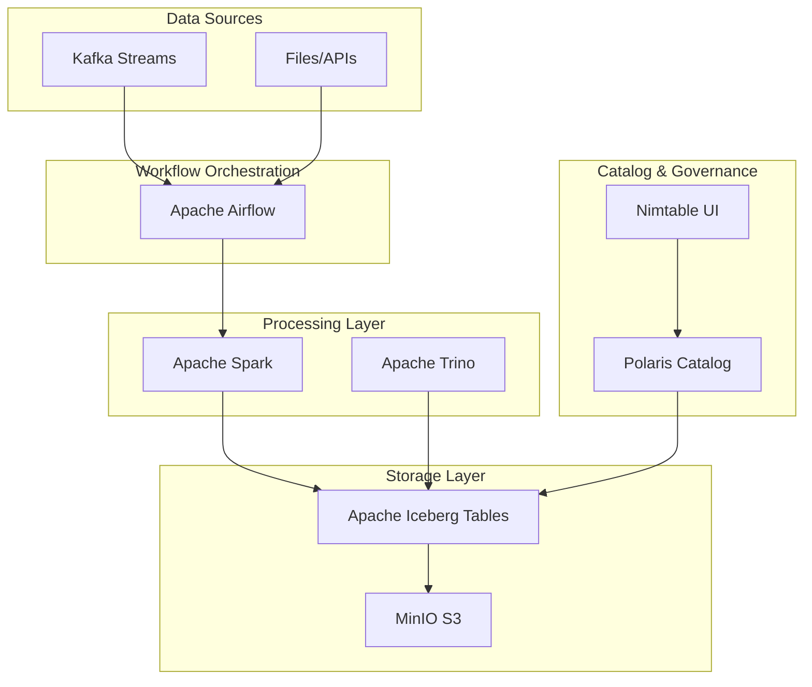

# 🏗️ Lakehouse Sandbox

> A comprehensive data lakehouse environment with Apache Iceberg, Polaris Catalog, Apache Kafka, Apache Airflow, Apache Trino, Apache Spark, and MinIO - all orchestrated with an easy-to-use Makefile.

## 🚀 Quick Start

Get your entire lakehouse environment running in seconds:

```bash
# Start everything
make all

# Check what's running  
make status

# View service URLs and credentials
make info

# Stop everything
make down
```

That's it! Your full lakehouse stack is ready to use.

## 📋 Table of Contents

- [🏗️ Architecture Overview](#️-architecture-overview)
- [🛠️ Prerequisites](#️-prerequisites)
- [⚡ Getting Started](#-getting-started)
- [🎯 Service Access](#-service-access)
- [📦 Service Management](#-service-management)
- [💻 Development Workflows](#-development-workflows)
- [🔧 Advanced Usage](#-advanced-usage)
- [🐛 Troubleshooting](#-troubleshooting)
- [🤝 Contributing](#-contributing)

## 🏗️ Architecture Overview

This sandbox provides a complete modern data lakehouse architecture:



### Core Components

- **🗄️ Apache Iceberg**: Open table format with ACID transactions
- **📊 Polaris Catalog**: Centralized metadata management for Iceberg
- **🔄 Apache Kafka**: High-throughput event streaming (3-node cluster)
- **⚡ Apache Airflow**: Workflow orchestration and scheduling
- **🧮 Apache Trino**: Distributed SQL query engine
- **⚙️ Apache Spark**: Unified analytics engine for big data processing
- **💾 MinIO**: S3-compatible object storage
- **🌐 Nimtable**: Modern web UI for Iceberg table management

## 🛠️ Prerequisites

- **Docker** (20.10+)
- **Docker Compose** (2.0+)
- **Make** (pre-installed on most Unix systems)
- **8GB+ RAM** recommended for full stack
- **Available Ports**: 8080, 8090-8091, 8181, 8888, 9000-9001, 9092-9094, 13000, 18182, 5433

## ⚡ Getting Started

### 1. Clone & Navigate
```bash
git clone <repository-url>
cd lakehouse-sandbox
```

### 2. Start All Services
```bash
make all
```

### 3. Verify Everything is Running
```bash
make status
```

### 4. Get Access Information
```bash
make info
```

## 🎯 Service Access

After running `make all`, access your services:

| Service | URL | Credentials |
|---------|-----|-------------|
| **Airflow** | http://localhost:8090 | admin / admin |
| **Kafka UI** | http://localhost:8091 | - |
| **Trino** | http://localhost:8080 | admin / (no password) |
| **Polaris** | http://localhost:8181 | - |
| **Spark/Jupyter** | http://localhost:8888 | - |
| **MinIO Console** | http://localhost:9001 | admin / password |
| **Nimtable** | http://localhost:13000 | admin / admin |

### API Endpoints
- **MinIO API**: http://localhost:9000
- **Nimtable API**: http://localhost:18182
- **Airflow Postgres**: localhost:5433
- **Kafka Brokers**: localhost:9092, localhost:9093, localhost:9094

## 📦 Service Management

The Makefile provides fine-grained control over service groups:

### All Services
```bash
make all          # Start everything
make down         # Stop everything  
make restart      # Restart everything
make status       # Show all service status
make logs         # Show all logs
make clean        # Stop and remove containers/volumes
```

### Individual Service Groups
```bash
# Core lakehouse services (Polaris, Trino, MinIO, Spark, Nimtable)
make core-up core-down core-status core-logs core-restart

# Kafka cluster and UI
make kafka-up kafka-down kafka-status kafka-logs kafka-restart

# Airflow workflow engine
make airflow-up airflow-down airflow-status airflow-logs airflow-restart
```

### Development Helpers
```bash
make pull           # Pull latest images
make build          # Build any custom images  
make watch          # Watch service status (live)
make healthcheck    # Check service health
make network        # Create shared network
```

## 💻 Development Workflows

### 🔄 Airflow Workflows

Create data pipelines in `/airflow/dags/`:

```python
# airflow/dags/lakehouse_etl.py
from airflow import DAG
from airflow.providers.apache.spark.operators.spark_sql import SparkSQLOperator
from datetime import datetime, timedelta

dag = DAG(
    'lakehouse_etl',
    default_args={
        'owner': 'data-team',
        'retries': 1,
        'retry_delay': timedelta(minutes=5),
    },
    start_date=datetime(2024, 1, 1),
    schedule_interval='@daily',
    catchup=False
)

# Extract from Kafka to Iceberg
kafka_to_iceberg = SparkSQLOperator(
    task_id='kafka_to_iceberg',
    sql="""
        CREATE OR REPLACE TEMPORARY VIEW kafka_stream AS
        SELECT * FROM TABLE(
            kafka_table('kafka1:29092', 'events')
        );
        
        INSERT INTO iceberg.db.events
        SELECT * FROM kafka_stream;
    """,
    dag=dag
)
```

### 📊 Spark Development

Access Spark via Jupyter at http://localhost:8888:

```python
# Example: Reading from Kafka and writing to Iceberg
from pyspark.sql import SparkSession

spark = SparkSession.builder \
    .appName("KafkaToIceberg") \
    .config("spark.sql.catalog.iceberg", "org.apache.iceberg.spark.SparkCatalog") \
    .config("spark.sql.catalog.iceberg.type", "rest") \
    .config("spark.sql.catalog.iceberg.uri", "http://polaris:8181/api/catalog/") \
    .getOrCreate()

# Stream from Kafka
df = spark \
    .readStream \
    .format("kafka") \
    .option("kafka.bootstrap.servers", "kafka1:29092,kafka2:29092,kafka3:29092") \
    .option("subscribe", "user_events") \
    .load()

# Write to Iceberg
query = df.writeStream \
    .format("iceberg") \
    .outputMode("append") \
    .option("path", "s3a://warehouse/analytics/user_events") \
    .option("checkpointLocation", "/tmp/checkpoint") \
    .start()

query.awaitTermination()
```

### 🗄️ Trino SQL Queries

Connect to Trino and query your lakehouse:

```bash
# Open Trino CLI
make shell-trino
```

```sql
-- Show available catalogs
SHOW CATALOGS;

-- Query Iceberg tables
SELECT * FROM iceberg.analytics.user_events 
WHERE event_date = current_date
LIMIT 10;

-- Join data across different sources
SELECT 
    u.user_id,
    u.event_type,
    p.product_name
FROM iceberg.analytics.user_events u
JOIN iceberg.product.catalog p ON u.product_id = p.id
WHERE u.event_date >= current_date - interval '7' day;
```

### 🚀 Kafka Streaming

#### Produce Test Data
```bash
# Create a topic
docker exec kafka1 kafka-topics \
    --create --topic user-events \
    --bootstrap-server localhost:29092 \
    --partitions 3 --replication-factor 3

# Produce messages
echo '{"user_id": 123, "event": "page_view", "timestamp": "2024-01-01T10:00:00Z"}' | \
docker exec -i kafka1 kafka-console-producer \
    --topic user-events --bootstrap-server localhost:29092
```

#### Python Producer/Consumer
```python
from kafka import KafkaProducer, KafkaConsumer
import json
from datetime import datetime

# Producer
producer = KafkaProducer(
    bootstrap_servers=['localhost:9092', 'localhost:9093', 'localhost:9094'],
    value_serializer=lambda x: json.dumps(x).encode('utf-8')
)

# Send events
for i in range(100):
    event = {
        'user_id': f'user_{i}',
        'event_type': 'click',
        'timestamp': datetime.now().isoformat(),
        'product_id': f'prod_{i % 10}'
    }
    producer.send('user-events', event)

producer.flush()

# Consumer
consumer = KafkaConsumer(
    'user-events',
    bootstrap_servers=['localhost:9092', 'localhost:9093', 'localhost:9094'],
    value_deserializer=lambda x: json.loads(x.decode('utf-8')),
    group_id='analytics-group'
)

for message in consumer:
    print(f"Received: {message.value}")
```

## 🔧 Advanced Usage

### Container Access
```bash
# Access service shells
make shell-spark      # Spark/Jupyter container
make shell-airflow    # Airflow webserver  
make shell-trino      # Trino CLI

# Direct docker exec
docker exec -it spark-iceberg bash
docker exec -it lakehouse-sandbox-airflow-webserver-1 bash
```

### Custom Configurations

#### Airflow Configuration
Edit `.env.airflow` to customize Airflow settings:
```env
AIRFLOW_UID=50000
AIRFLOW_PROJ_DIR=.
_AIRFLOW_WWW_USER_USERNAME=admin
_AIRFLOW_WWW_USER_PASSWORD=admin
AIRFLOW__CORE__FERNET_KEY=your-fernet-key
```

#### Spark Configuration
Mount custom Spark configurations in `docker-compose.yml`:
```yaml
volumes:
  - ./spark-configs:/opt/spark/conf
```

#### Trino Catalogs
Add custom catalogs in `./trino/catalog/`:
```properties
# ./trino/catalog/mysql.properties
connector.name=mysql
connection-url=jdbc:mysql://mysql-server:3306
connection-user=admin
connection-password=password
```

### Scaling Services

#### Scale Kafka
Add more brokers by modifying `docker-compose.kafka.yml` and updating the cluster configuration.

#### Resource Limits
Adjust container resources in compose files:
```yaml
services:
  spark-iceberg:
    deploy:
      resources:
        limits:
          memory: 8g
          cpus: '4'
```

## 🐛 Troubleshooting

### Common Issues

#### Port Conflicts
```bash
# Check what's using ports
netstat -tulpn | grep :8080

# Stop conflicting services
sudo systemctl stop apache2  # Example
```

#### Memory Issues
```bash
# Check Docker resources
docker system df
docker system prune  # Clean up unused resources

# Adjust Docker Desktop memory allocation (8GB+ recommended)
```

#### Service Won't Start
```bash
# Check specific service logs
make airflow-logs
make kafka-logs  
make core-logs

# Check individual container
docker logs lakehouse-sandbox-airflow-webserver-1
```

#### Network Issues
```bash
# Recreate network
make network-clean
make network

# Check network connectivity
docker network ls
docker network inspect local-iceberg-lakehouse
```

### Reset Everything
```bash
# Nuclear option - clean slate
make clean-all
docker system prune -a --volumes
make all
```

### Service Health Check
```bash
# Monitor service health
make healthcheck
make watch  # Live monitoring
```

## 🔍 Monitoring & Observability

### Service Status
```bash
# Quick health check
make status

# Detailed health information  
make healthcheck

# Live monitoring (refreshes every 2 seconds)
make watch
```

### Log Analysis
```bash
# All service logs
make logs

# Specific service logs  
make airflow-logs
make kafka-logs
make core-logs

# Follow logs in real-time
docker logs -f lakehouse-sandbox-airflow-scheduler-1
```

### Resource Usage
```bash
# Container resource usage
docker stats

# System resource usage
docker system df
docker system events  # Live system events
```

## 🤝 Contributing

### Development Setup
```bash
# Fork and clone the repository
git clone https://github.com/your-username/lakehouse-sandbox.git
cd lakehouse-sandbox

# Create feature branch
git checkout -b feature/awesome-feature

# Make changes and test
make clean-all
make all
make status

# Commit and push
git commit -m "Add awesome feature"
git push origin feature/awesome-feature
```

### Adding New Services
1. Add service to appropriate `docker-compose*.yml`
2. Update Makefile with new targets
3. Update README.md with service documentation
4. Test with `make all` and `make status`
5. Update port conflict check

### Testing Changes
```bash
# Test individual service groups
make core-restart
make kafka-restart  
make airflow-restart

# Full integration test
make clean-all && make all
```

---
**Happy Data Engineering!** 🚀
