# 🏗️ Lakehouse Sandbox

> **The Ultimate Data Engineering Playground** - A complete, production-ready lakehouse environment with Apache Iceberg, modern SQL engines, streaming capabilities, and cloud-native sandbox environments. Perfect for learning, development, migration testing, and architectural exploration.

[](https://docker.com)
[](https://iceberg.apache.org/)
[](https://trino.io/)
[](https://spark.apache.org/)
[](http://localhost:3000)

## 🎯 Why Lakehouse Sandbox?

### **For Data Engineers** 👨‍💻
- **Learn Modern Architectures** - Hands-on experience with lakehouse patterns, Iceberg tables, and open-source data stack
- **Test Migration Strategies** - Validate Snowflake-to-lakehouse and Databricks-to-open-source migrations safely
- **Prototype Quickly** - Spin up complete data infrastructure in minutes, not weeks
- **Benchmark Performance** - Compare query engines, storage formats, and processing frameworks

### **For Data Teams** 🏢 
- **Standardize Development** - Consistent environment for all team members across laptops and cloud
- **Reduce Cloud Costs** - Develop and test locally before deploying to expensive cloud resources
- **Enable Innovation** - Experiment with cutting-edge data technologies without infrastructure complexity
- **Accelerate Onboarding** - New team members productive in minutes with `make up`

### **For Organizations** 🚀
- **De-risk Architecture Decisions** - Test lakehouse patterns before committing to cloud implementations  
- **Validate Vendor Claims** - Compare Databricks/Snowflake against open-source alternatives
- **Plan Migrations** - Test compatibility and performance before moving production workloads
- **Train Teams** - Upskill engineers on modern data architectures with realistic environments

---

## ⚡ Get Started in 30 Seconds

```bash
# Clone and start everything
git clone https://github.com/your-org/lakehouse-sandbox.git
cd lakehouse-sandbox
make all

# 🎉 That's it! Your lakehouse is ready at:
# 📊 WebUI Management: http://localhost:3000
# 🗄️ SQL Editor: Click "Code" button in WebUI  
# 📈 All Services: make info
```

**What you get instantly:**
- ✅ **Full Iceberg Lakehouse** with Polaris catalog and MinIO storage
- ✅ **Dual SQL Engines** - Trino for federation + Spark for processing  
- ✅ **Streaming Stack** - Kafka + Spark Streaming for real-time data
- ✅ **Workflow Orchestration** - Airflow with DAGs and scheduling
- ✅ **Cloud SQL Sandboxes** - Databricks + Snowflake API compatibility
- ✅ **Modern Web Interface** - Monitor, query, and manage everything
- ✅ **Jupyter Environment** - Interactive notebooks with PySpark
- ✅ **Integration Tests** - Validate everything works perfectly

---

## 🏗️ Architecture Overview

```mermaid
graph TB
    subgraph "Data Ingestion"
        K[📡 Kafka Streams<br/>Port: 9092]
        F[📁 File Uploads<br/>S3 Compatible]
    end
    
    subgraph "Processing Layer"
        S[⚡ Spark Jupyter<br/>Port: 8888]
        T[🔍 Trino Engine<br/>Port: 8080]
        A[🔄 Airflow<br/>Port: 8090]
    end
    
    subgraph "Storage & Catalog"
        P[📊 Polaris Catalog<br/>Port: 8181]
        M[🪣 MinIO Storage<br/>Port: 9000/9001]
        I[(🏔️ Iceberg Tables<br/>ACID + Time Travel)]
    end
    
    subgraph "SQL Compatibility"
        DB[🧱 Databricks Sandbox<br/>Port: 5434]
        SF[❄️ Snowflake Sandbox<br/>Port: 5435]
    end
    
    subgraph "Management & Monitoring"
        W[🌐 WebUI Dashboard<br/>Port: 3000]
        N[📊 Nimtable UI<br/>Port: 13000]
    end
    
    K --> S
    F --> M
    S --> I
    T --> I
    A --> S
    A --> T
    P --> I
    M --> I
    DB --> S
    SF --> T
    W --> DB
    W --> SF
    W --> T
    N --> P
```



---

## 📚 Complete Documentation

### 🎮 **Getting Started Guides**
- **[📋 Quick Start Guide](#-quick-start)** - Get running in 30 seconds
- **[🎯 Service Access Guide](#-service-access)** - URLs, credentials, and endpoints
- **[🧪 Integration Testing](#-integration-testing)** - Validate your environment

### 🔧 **Service Documentation**
- **[🏗️ Core Services Guide](docs/CORE_SERVICES.md)** - Polaris, Trino, Spark, MinIO, Kafka, Airflow
- **[🧱 Databricks Sandbox](docs/DATABRICKS_SANDBOX.md)** - SQL API emulation and Unity Catalog
- **[❄️ Snowflake Sandbox](docs/SNOWFLAKE_SANDBOX.md)** - SQL translation and migration testing
- **[🌐 WebUI Management Console](docs/WEBUI.md)** - Modern interface for monitoring and control

### 🚀 **Advanced Topics** 
- **[💻 Development Workflows](#-development-workflows)** - Best practices for data development
- **[🔧 Advanced Configuration](#-advanced-usage)** - Customization and optimization
- **[🐛 Troubleshooting Guide](#-troubleshooting)** - Common issues and solutions

---

## 🚀 Quick Start

### Prerequisites
- **Docker** 20.10+ with Docker Compose
- **8GB+ RAM** (16GB recommended for full stack)
- **10GB+ disk space** for containers and data

### One-Command Setup
```bash
# Start everything with WebUI
make all

# Or step by step
make up          # Start core lakehouse services
make webui-up    # Start WebUI management interface  
make test        # Run integration tests
make info        # Display service URLs and credentials
```

### Verify Everything Works
```bash
# Quick health check
make status

# Run comprehensive tests
make test

# 🎉 Success! All services running and tested
```

---

## 🎯 Service Access

| Service | URL | Credentials | Purpose |
|---------|-----|-------------|---------|
| 🌐 **WebUI Dashboard** | http://localhost:3000 | None | Management interface |
| 🧱 **Databricks SQL Editor** | http://localhost:3000 → Code button | None | Interactive SQL development |
| 🔍 **Trino Query Engine** | http://localhost:8080 | None | SQL federation |
| ⚡ **Spark Jupyter** | http://localhost:8888 | Token: `lakehouse` | Interactive notebooks |
| 🪣 **MinIO Console** | http://localhost:9001 | admin / password | Object storage |
| 🗄️ **Polaris Catalog** | http://localhost:8181 | None | Metadata API |
| 🔄 **Airflow** | http://localhost:8090 | admin / admin | Workflow orchestration |
| 📊 **Kafka UI** | http://localhost:8091 | None | Stream monitoring |
| 📋 **Nimtable** | http://localhost:13000 | admin / admin | Table management |
| ❄️ **Snowflake API** | http://localhost:5435 | None | SQL translation |
| 🧱 **Databricks API** | http://localhost:5434 | None | SQL emulation |

### Quick Access Commands
```bash
make info        # Show all URLs and credentials
make webui       # Open WebUI in browser
make trino       # Open Trino in browser  
make jupyter     # Open Jupyter in browser
make airflow     # Open Airflow in browser
```

---

## 🧪 Integration Testing

Validate your environment with comprehensive test suites:

```bash
# Run all integration tests
make test

# Test specific service groups
python3 tests/integration/test_runner.py --groups core
python3 tests/integration/test_runner.py --groups kafka airflow
python3 tests/integration/test_runner.py --groups integrations

# Test sandbox environments
python3 tests/integration/test_databricks_sandbox.py
python3 tests/integration/test_snowflake_sandbox.py

# Generate detailed test report
python3 tests/integration/test_runner.py --output test_report.json
```

**Test Coverage:**
- ✅ **14 Core Service Tests** - Health, connectivity, basic operations
- ✅ **10 Databricks SQL Tests** - API compatibility, query execution, Unity Catalog
- ✅ **8 Snowflake Translation Tests** - SQL conversion, function mapping
- ✅ **5 Integration Tests** - Cross-service communication and data flow
- ✅ **Performance Benchmarks** - Query execution times and resource usage

---

## 📦 Service Management

### Lifecycle Commands
```bash
# Complete environment
make up          # Start all services
make down        # Stop all services  
make restart     # Restart all services
make clean       # Remove all containers and volumes

# Service groups
make core-up     # Start core lakehouse services
make kafka-up    # Start streaming services
make airflow-up  # Start workflow services
make webui-up    # Start WebUI interface

# Individual services (via WebUI or docker)
docker start lakehouse-sandbox-trino-1
docker restart lakehouse-sandbox-databricks-sandbox-1
```

### Monitoring & Debugging
```bash
make status      # Show service status
make logs        # Tail all service logs
make ps          # List running containers

# Individual service logs
docker logs -f lakehouse-sandbox-trino-1
docker logs -f lakehouse-sandbox-databricks-sandbox-1

# Resource monitoring
docker stats
```

---

## 💻 Development Workflows

### Data Engineering Workflow
```bash
# 1. Start environment
make all

# 2. Develop in Jupyter (http://localhost:8888)
# - Create notebooks with PySpark
# - Connect to Iceberg catalog
# - Process data with Spark SQL

# 3. Query with Trino (http://localhost:8080 or WebUI)
# - Run analytical queries
# - Join data across sources  
# - Test performance

# 4. Orchestrate with Airflow (http://localhost:8090)
# - Create DAGs for workflows
# - Schedule batch processing
# - Monitor execution

# 5. Stream with Kafka
# - Ingest real-time data
# - Process with Spark Streaming
# - Store in Iceberg tables
```

### Migration Testing Workflow
```bash
# Test Databricks compatibility
curl -X POST http://localhost:5434/api/2.0/sql/statements \
  -d '{"statement": "SELECT current_catalog(), COUNT(*) FROM my_table"}'

# Test Snowflake translation  
curl -X POST http://localhost:5435/api/v1/query \
  -d '{"sql": "SELECT CURRENT_WAREHOUSE(), CURRENT_DATABASE()"}'

# Compare performance
python3 scripts/benchmark_queries.py --engine databricks
python3 scripts/benchmark_queries.py --engine snowflake  
python3 scripts/benchmark_queries.py --engine trino
```

### Schema Development Workflow
```sql
-- 1. Create Iceberg table (via Trino or Spark)
CREATE TABLE iceberg.analytics.customer_metrics (
    customer_id BIGINT,
    total_orders INTEGER,
    lifetime_value DECIMAL(10,2),
    last_order_date DATE,
    created_at TIMESTAMP
) WITH (format = 'PARQUET');

-- 2. Test schema evolution
ALTER TABLE iceberg.analytics.customer_metrics 
ADD COLUMN customer_segment VARCHAR;

-- 3. Query with time travel
SELECT * FROM iceberg.analytics.customer_metrics 
FOR VERSION AS OF 1;

-- 4. Validate via WebUI SQL Editor
-- Navigate to http://localhost:3000 → Code button
-- Browse schema, execute queries, export results
```

---

## 🔧 Advanced Usage

### Custom Configuration
```bash
# Override default settings
cp docker-compose.override.yml.example docker-compose.override.yml
# Edit configurations for your needs

# Custom environment variables
export TRINO_MEMORY_GB=8
export SPARK_WORKER_CORES=4
export KAFKA_HEAP_OPTS="-Xmx2G"

make up
```

### Performance Optimization
```bash
# Increase resource limits
# Edit docker-compose.override.yml:
services:
  trino:
    deploy:
      resources:
        limits:
          memory: 8G
          cpus: '4'

# Tune JVM settings
environment:
  - JAVA_OPTS=-Xmx6G -XX:+UseG1GC
```

### Production Readiness
```bash
# Enable monitoring
make monitoring-up    # Start Prometheus + Grafana

# Setup persistent volumes
# Edit docker-compose.yml to use named volumes

# Configure security
# Add authentication to services
# Setup SSL/TLS certificates
# Configure network policies
```

---

## 🐛 Troubleshooting

### Common Issues

**Services Won't Start**
```bash
# Check system resources
docker system df
docker system events

# Clean up if needed
make clean
docker system prune -a

# Check port conflicts
netstat -tulpn | grep :8080
```

**Memory Issues**
```bash
# Increase Docker memory limit (8GB+ recommended)
# Docker Desktop → Settings → Resources → Memory

# Monitor resource usage
docker stats
make status
```

**Network Connectivity**
```bash
# Check service health
make test

# Verify internal DNS
docker exec -it lakehouse-sandbox-trino-1 nslookup polaris
docker exec -it lakehouse-sandbox-databricks-sandbox-1 ping trino
```

**Query Failures**
```bash
# Check catalog connectivity  
curl http://localhost:8181/api/catalog/v1/config

# Verify table access
docker exec -it lakehouse-sandbox-trino-1 trino --execute "SHOW CATALOGS;"

# Review service logs
docker logs lakehouse-sandbox-trino-1
```

### Getting Help
```bash
# Run diagnostics
make diagnose      # Comprehensive health check

# View detailed logs
make logs SERVICE=trino
make logs SERVICE=databricks-sandbox

# Reset environment
make clean && make up
```

---

## 🎉 What Makes This Special?

### **🚀 Production-Ready Architecture**
- **Apache Iceberg** - Modern table format with ACID transactions
- **Polaris Catalog** - Enterprise-grade metadata management  
- **Dual Query Engines** - Trino for analytics + Spark for processing
- **Cloud-Native Storage** - S3-compatible MinIO with versioning

### **🧪 Sandbox Environments**  
- **Databricks SQL API** - Full compatibility for migration testing
- **Snowflake Translation** - SQL conversion and function mapping
- **Performance Benchmarks** - Compare engines objectively
- **Real Migration Data** - Test with your actual queries

### **🌐 Modern Developer Experience**
- **Interactive WebUI** - Manage everything from your browser
- **Built-in SQL Editor** - Write, execute, export queries
- **Jupyter Integration** - Data science workflows
- **Real-time Monitoring** - Service health and performance

### **📈 Enterprise Features**
- **Comprehensive Testing** - 30+ automated integration tests
- **Workflow Orchestration** - Airflow with DAGs and scheduling  
- **Stream Processing** - Kafka + Spark for real-time analytics
- **Schema Management** - Evolution, lineage, and governance

---

## 🤝 Contributing

We welcome contributions! This sandbox benefits the entire data engineering community.

```bash
# Development setup
git clone https://github.com/your-org/lakehouse-sandbox.git
cd lakehouse-sandbox
make dev-setup

# Run tests
make test-all

# Submit improvements
git checkout -b feature/your-improvement
# Make your changes
git commit -m "Add: your improvement"
git push origin feature/your-improvement
# Create pull request
```

**Areas for Contribution:**
- 🔌 **New Connectors** - Additional data sources
- 🧪 **Test Scenarios** - More migration test cases  
- 📊 **Dashboard Widgets** - Enhanced WebUI features
- 🚀 **Performance Optimizations** - Query and system tuning
- 📚 **Documentation** - Tutorials and use cases

---

## 📈 Roadmap

### Coming Soon
- [ ] **Delta Lake Integration** - Full lakehouse format support
- [ ] **Kubernetes Deployment** - Cloud-native orchestration  
- [ ] **Authentication & RBAC** - Enterprise security features
- [ ] **Monitoring Stack** - Prometheus + Grafana integration
- [ ] **More SQL Sandboxes** - BigQuery, Redshift compatibility
- [ ] **ML Pipeline Integration** - MLflow + model serving

### Long Term Vision
- **Multi-Cloud Support** - Deploy anywhere (AWS, Azure, GCP)
- **Auto-Scaling** - Dynamic resource allocation
- **Data Governance** - Built-in compliance and lineage
- **Marketplace** - Pre-built data applications and use cases

---

## 🏆 Perfect For

### **🎓 Learning & Education**
- **Data Engineering Bootcamps** - Hands-on lakehouse experience
- **University Courses** - Modern data architecture curriculum
- **Self-Paced Learning** - Explore technologies safely
- **Certification Prep** - Practice with real tools

### **🏢 Enterprise Adoption**  
- **Architecture Evaluation** - Test before you invest
- **Migration Planning** - Validate compatibility and performance
- **Team Training** - Standardized learning environment
- **Proof of Concepts** - Demonstrate lakehouse value

### **🚀 Startup & Innovation**
- **Rapid Prototyping** - Data products in minutes
- **Cost Optimization** - Avoid vendor lock-in
- **Technical Interviews** - Assess candidates with real scenarios
- **Customer Demos** - Showcase data capabilities

---

## 🌟 Get Started Today

**Ready to revolutionize your data engineering experience?**

```bash
git clone https://github.com/your-org/lakehouse-sandbox.git
cd lakehouse-sandbox
make all

# 🎉 Your complete data lakehouse is ready!
# 📊 WebUI: http://localhost:3000
# 💡 Start with the interactive SQL Editor
# 🚀 Build the future of data engineering
```

---

**Questions? Issues? Ideas?** 
- 💬 **Discussions**: Share use cases and get help
- 🐛 **Issues**: Report bugs and request features
- 📧 **Email**: reach out to maintainers [ananth@dataengineeringweekly.com]
- 📚 **Documentation**: Comprehensive guides for everything

**⭐ Star this repo if it helps your data engineering journey!**

---

*Built with ❤️ for the data engineering community. Licensed under Apache 2.0.*