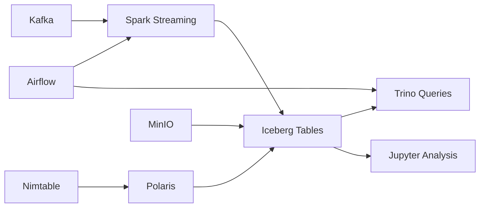

# 🏗️ Core Services Guide

> Comprehensive documentation for the foundational services that power the Lakehouse Sandbox: Apache Iceberg, Polaris Catalog, Trino, Spark, MinIO, Kafka, and Airflow.

## 📋 Service Overview

| Service | Purpose | Port | Key Features |
|---------|---------|------|--------------|
| **Polaris Catalog** | Metadata management | 8181 | Iceberg catalog, REST API, multi-engine support |
| **Trino** | Query engine | 8080 | SQL federation, connectors, performance |
| **MinIO** | Object storage | 9000/9001 | S3-compatible, data lake storage |
| **Spark Jupyter** | Interactive computing | 8888 | Notebooks, PySpark, Iceberg integration |
| **Kafka** | Stream processing | 9092/8091 | Event streaming, real-time data |
| **Airflow** | Workflow orchestration | 8090 | DAGs, scheduling, monitoring |
| **Nimtable** | Table management | 13000 | Schema registry, catalog UI |

---

## 🗄️ Polaris Catalog

**Apache Polaris** provides centralized metadata management for Iceberg tables with multi-engine support.

### Key Features
- ✅ **REST API** for catalog operations
- ✅ **Multi-Engine Support** (Trino, Spark, Databricks)
- ✅ **Table Versioning** and history
- ✅ **Schema Evolution** capabilities
- ✅ **Access Control** and permissions

### API Endpoints
```bash
# Catalog configuration
GET http://localhost:8181/api/catalog/v1/config

# List namespaces  
GET http://localhost:8181/api/catalog/v1/namespaces

# Create namespace
POST http://localhost:8181/api/catalog/v1/namespaces
{
  "namespace": ["analytics", "staging"],
  "properties": {"owner": "data-team"}
}

# List tables in namespace
GET http://localhost:8181/api/catalog/v1/namespaces/default/tables

# Get table metadata
GET http://localhost:8181/api/catalog/v1/namespaces/default/tables/my_table
```

### Usage Examples
```sql
-- Via Trino
CREATE TABLE iceberg.analytics.sales (
    id BIGINT,
    product_name VARCHAR,
    amount DECIMAL(10,2),
    sale_date DATE
) WITH (format = 'PARQUET');

-- Via Spark
spark.sql("""
CREATE TABLE iceberg.analytics.sales
USING ICEBERG
AS SELECT * FROM temp_sales_data
""")
```

### Monitoring
```bash
# Health check
curl http://localhost:8181/api/catalog/v1/config

# Catalog statistics
curl http://localhost:8181/api/catalog/v1/namespaces | jq '.namespaces | length'
```

---

## ⚡ Trino Query Engine

**Trino** provides high-performance, distributed SQL query execution across multiple data sources.

### Key Features
- ✅ **Federated Queries** across catalogs
- ✅ **Iceberg Integration** with advanced features
- ✅ **Connector Ecosystem** (PostgreSQL, MySQL, etc.)
- ✅ **Cost-Based Optimizer** for performance
- ✅ **Columnar Processing** for analytics

### Catalogs Configuration
```sql
-- Available catalogs
SHOW CATALOGS;

-- Iceberg catalog (primary)
SHOW SCHEMAS IN iceberg;
SHOW TABLES IN iceberg.default;

-- System catalog for metadata
SELECT * FROM system.runtime.nodes;
SELECT * FROM system.metadata.catalogs;
```

### Query Examples
```sql
-- Basic analytics query
SELECT 
    DATE_TRUNC('month', order_date) as month,
    COUNT(*) as orders,
    SUM(amount) as revenue
FROM iceberg.sales.orders 
WHERE order_date >= DATE('2024-01-01')
GROUP BY 1
ORDER BY 1;

-- Cross-catalog federation (if multiple catalogs configured)
SELECT t1.customer_id, t2.customer_name, COUNT(*) as orders
FROM iceberg.sales.orders t1
JOIN postgresql.crm.customers t2 ON t1.customer_id = t2.id
GROUP BY t1.customer_id, t2.customer_name;

-- Time travel with Iceberg
SELECT * FROM iceberg.sales.orders 
FOR VERSION AS OF 12345;

-- Schema evolution
ALTER TABLE iceberg.sales.orders 
ADD COLUMN customer_segment VARCHAR;
```

### Performance Tuning
```sql
-- Analyze query plans
EXPLAIN (FORMAT JSON) 
SELECT * FROM iceberg.sales.orders WHERE amount > 1000;

-- Statistics collection
ANALYZE TABLE iceberg.sales.orders;

-- Partition pruning
SELECT * FROM iceberg.sales.orders 
WHERE order_date BETWEEN DATE('2024-01-01') AND DATE('2024-01-31');
```

### Monitoring
```bash
# Cluster info
curl http://localhost:8080/v1/info | jq

# Node status
curl http://localhost:8080/v1/node | jq

# Query statistics
curl http://localhost:8080/v1/query | jq '.[] | {queryId, state, elapsedTime}'
```

---

## 🪣 MinIO Object Storage

**MinIO** provides S3-compatible object storage for the data lakehouse layer.

### Key Features
- ✅ **S3 Compatibility** for seamless integration
- ✅ **High Performance** with erasure coding
- ✅ **Web Console** for management
- ✅ **Access Policies** and user management
- ✅ **Bucket Notifications** for event-driven workflows

### Access Information
- **API Endpoint**: http://localhost:9000
- **Console**: http://localhost:9001
- **Credentials**: admin / password
- **Default Bucket**: `lakehouse`

### S3 CLI Usage
```bash
# Configure AWS CLI for MinIO
aws configure set aws_access_key_id admin
aws configure set aws_secret_access_key password
aws configure set default.region us-east-1
aws configure set default.s3.endpoint_url http://localhost:9000

# List buckets
aws s3 ls --endpoint-url http://localhost:9000

# Upload data
aws s3 cp data.parquet s3://lakehouse/sales/data.parquet --endpoint-url http://localhost:9000

# List objects
aws s3 ls s3://lakehouse/sales/ --recursive --endpoint-url http://localhost:9000
```

### Python SDK Usage
```python
from minio import Minio

# Initialize client
client = Minio(
    "localhost:9000",
    access_key="admin",
    secret_key="password",
    secure=False
)

# Upload file
client.fput_object("lakehouse", "data/sample.parquet", "local_file.parquet")

# List objects
objects = client.list_objects("lakehouse", prefix="data/", recursive=True)
for obj in objects:
    print(obj.object_name, obj.size, obj.last_modified)
```

### Bucket Policies
```json
{
  "Version": "2012-10-17",
  "Statement": [
    {
      "Effect": "Allow", 
      "Principal": {"AWS": ["*"]},
      "Action": ["s3:GetObject"],
      "Resource": ["arn:aws:s3:::lakehouse/public/*"]
    }
  ]
}
```

---

## 🔥 Spark Jupyter Environment

**Apache Spark** with Jupyter provides interactive data processing and analytics capabilities.

### Key Features
- ✅ **PySpark 3.5.0** with latest features
- ✅ **Iceberg Integration** for lakehouse tables
- ✅ **Delta Lake Support** for ACID operations
- ✅ **Jupyter Notebooks** for interactive development
- ✅ **Pre-configured** with connectors and catalogs

### Access
- **Jupyter Lab**: http://localhost:8888
- **Token**: `lakehouse` (pre-configured)

### Notebook Examples

#### Basic Iceberg Operations
```python
from pyspark.sql import SparkSession

# Spark session with Iceberg
spark = SparkSession.builder \
    .appName("LakehouseSandbox") \
    .config("spark.sql.extensions", "org.apache.iceberg.spark.extensions.IcebergSparkSessionExtensions") \
    .config("spark.sql.catalog.iceberg", "org.apache.iceberg.spark.SparkCatalog") \
    .config("spark.sql.catalog.iceberg.type", "rest") \
    .config("spark.sql.catalog.iceberg.uri", "http://polaris:8181/api/catalog/v1/") \
    .getOrCreate()

# Create table
spark.sql("""
CREATE TABLE iceberg.default.sales (
    id BIGINT,
    product_name STRING,
    amount DECIMAL(10,2),
    sale_date DATE
) USING ICEBERG
""")

# Insert data
spark.sql("""
INSERT INTO iceberg.default.sales VALUES
(1, 'Laptop', 999.99, '2024-01-15'),
(2, 'Mouse', 29.99, '2024-01-16'),
(3, 'Keyboard', 79.99, '2024-01-17')
""")

# Query data
df = spark.sql("SELECT * FROM iceberg.default.sales")
df.show()
```

#### Advanced Analytics
```python
# Read Iceberg table as DataFrame
df = spark.table("iceberg.default.sales")

# Data transformations
monthly_sales = df.groupBy(
    F.date_trunc("month", F.col("sale_date")).alias("month")
).agg(
    F.count("*").alias("order_count"),
    F.sum("amount").alias("total_revenue"),
    F.avg("amount").alias("avg_order_value")
)

# Write results back to Iceberg
monthly_sales.writeTo("iceberg.analytics.monthly_sales").create()

# Time travel
previous_version = spark.sql("""
SELECT * FROM iceberg.default.sales 
VERSION AS OF 1
""")
```

#### Machine Learning Pipeline
```python
from pyspark.ml.feature import VectorAssembler
from pyspark.ml.regression import LinearRegression
from pyspark.ml.evaluation import RegressionEvaluator

# Prepare features
assembler = VectorAssembler(inputCols=["feature1", "feature2"], outputCol="features")
train_data = assembler.transform(df).select("features", "amount")

# Train model
lr = LinearRegression(featuresCol="features", labelCol="amount")
model = lr.fit(train_data)

# Save model metadata to Iceberg
model_info = spark.createDataFrame([
    (model.uid, model.coefficients.toArray().tolist(), model.intercept, datetime.now())
], ["model_id", "coefficients", "intercept", "created_at"])

model_info.writeTo("iceberg.ml.models").append()
```

---

## 🌊 Apache Kafka (Stream Processing)

**Apache Kafka** enables real-time data streaming and event-driven architectures.

### Key Features
- ✅ **High Throughput** message streaming
- ✅ **Kafka UI** for management and monitoring
- ✅ **Topic Management** with retention policies
- ✅ **Consumer Groups** for parallel processing
- ✅ **Schema Registry** integration ready

### Access Information
- **Kafka Brokers**: localhost:9092
- **Kafka UI**: http://localhost:8091

### Topic Management
```bash
# Create topic
docker exec kafka1 /opt/kafka/bin/kafka-topics.sh \
  --bootstrap-server localhost:29092 \
  --create --topic sales-events \
  --partitions 3 --replication-factor 1

# List topics
docker exec kafka1 /opt/kafka/bin/kafka-topics.sh \
  --bootstrap-server localhost:29092 --list

# Topic details
docker exec kafka1 /opt/kafka/bin/kafka-topics.sh \
  --bootstrap-server localhost:29092 \
  --describe --topic sales-events
```

### Producer Examples
```bash
# Command line producer
docker exec -it kafka1 /opt/kafka/bin/kafka-console-producer.sh \
  --bootstrap-server localhost:29092 \
  --topic sales-events

# Python producer
from kafka import KafkaProducer
import json

producer = KafkaProducer(
    bootstrap_servers=['localhost:9092'],
    value_serializer=lambda v: json.dumps(v).encode('utf-8')
)

# Send event
event = {
    "event_id": "12345",
    "customer_id": "cust_001", 
    "product_id": "prod_567",
    "amount": 99.99,
    "timestamp": "2024-01-15T10:30:00Z"
}

producer.send('sales-events', event)
producer.flush()
```

### Consumer Examples
```bash
# Command line consumer
docker exec -it kafka1 /opt/kafka/bin/kafka-console-consumer.sh \
  --bootstrap-server localhost:29092 \
  --topic sales-events --from-beginning

# Python consumer
from kafka import KafkaConsumer
import json

consumer = KafkaConsumer(
    'sales-events',
    bootstrap_servers=['localhost:9092'],
    value_deserializer=lambda m: json.loads(m.decode('utf-8')),
    group_id='analytics-group',
    auto_offset_reset='earliest'
)

for message in consumer:
    event = message.value
    print(f"Received: {event}")
    # Process event -> write to Iceberg
```

### Spark Streaming Integration
```python
# Structured streaming from Kafka to Iceberg
df = spark \
    .readStream \
    .format("kafka") \
    .option("kafka.bootstrap.servers", "kafka1:29092") \
    .option("subscribe", "sales-events") \
    .load()

# Parse JSON and transform
parsed_df = df.select(
    F.from_json(F.col("value").cast("string"), schema).alias("event")
).select("event.*")

# Write to Iceberg table
query = parsed_df.writeStream \
    .format("iceberg") \
    .outputMode("append") \
    .option("path", "iceberg.streaming.sales_events") \
    .option("checkpointLocation", "/tmp/checkpoints/sales") \
    .start()
```

---

## 🔄 Apache Airflow (Orchestration)

**Apache Airflow** provides workflow orchestration and job scheduling capabilities.

### Key Features
- ✅ **DAG-based Workflows** with Python
- ✅ **Web UI** for monitoring and management
- ✅ **Scheduler** with cron-like capabilities
- ✅ **Executors** for parallel task execution
- ✅ **Extensive Operators** for various services

### Access Information
- **Web UI**: http://localhost:8090
- **Credentials**: admin / admin

### DAG Examples

#### Daily Sales Processing
```python
# dags/sales_processing.py
from airflow import DAG
from airflow.operators.bash_operator import BashOperator
from airflow.operators.python_operator import PythonOperator
from datetime import datetime, timedelta

default_args = {
    'owner': 'data-team',
    'depends_on_past': False,
    'start_date': datetime(2024, 1, 1),
    'email_on_failure': False,
    'email_on_retry': False,
    'retries': 1,
    'retry_delay': timedelta(minutes=5)
}

dag = DAG(
    'daily_sales_processing',
    default_args=default_args,
    description='Daily sales data processing pipeline',
    schedule_interval='@daily',
    catchup=False
)

def process_sales_data(**context):
    from pyspark.sql import SparkSession
    
    spark = SparkSession.builder.appName("AirflowSales").getOrCreate()
    
    # Read raw data
    df = spark.read.format("delta").load("s3a://lakehouse/raw/sales/")
    
    # Transform
    processed = df.groupBy("product_category", "date") \
                 .agg({"amount": "sum", "quantity": "sum"})
    
    # Write to Iceberg
    processed.writeTo("iceberg.analytics.daily_sales").append()

# Tasks
extract_task = BashOperator(
    task_id='extract_raw_data',
    bash_command='python /scripts/extract_sales.py {{ ds }}',
    dag=dag
)

process_task = PythonOperator(
    task_id='process_sales_data',
    python_callable=process_sales_data,
    dag=dag
)

validate_task = BashOperator(
    task_id='validate_results', 
    bash_command='python /scripts/validate_sales.py {{ ds }}',
    dag=dag
)

# Dependencies
extract_task >> process_task >> validate_task
```

#### ML Model Training Pipeline
```python
# dags/ml_training.py
from airflow import DAG
from airflow.operators.python_operator import PythonOperator

def train_model(**context):
    from pyspark.ml.regression import LinearRegression
    from pyspark.sql import SparkSession
    
    spark = SparkSession.builder.appName("MLTraining").getOrCreate()
    
    # Read training data from Iceberg
    df = spark.table("iceberg.ml.training_data")
    
    # Train model
    lr = LinearRegression(featuresCol="features", labelCol="target")
    model = lr.fit(df)
    
    # Save model
    model.write().overwrite().save("s3a://lakehouse/models/sales_prediction/")
    
    # Log metrics to Iceberg
    metrics = spark.createDataFrame([
        (context['ds'], model.summary.r2, model.summary.rootMeanSquaredError)
    ], ["training_date", "r2_score", "rmse"])
    
    metrics.writeTo("iceberg.ml.model_metrics").append()

dag = DAG(
    'ml_model_training',
    schedule_interval='@weekly',
    start_date=datetime(2024, 1, 1)
)

train_task = PythonOperator(
    task_id='train_model',
    python_callable=train_model,
    dag=dag
)
```

### Monitoring and Management
```bash
# List DAGs
airflow dags list

# Trigger DAG run
airflow dags trigger daily_sales_processing

# Check task status
airflow tasks state daily_sales_processing process_sales_data 2024-01-15

# View logs
airflow tasks log daily_sales_processing process_sales_data 2024-01-15
```

---

## 📊 Nimtable (Table Management)

**Nimtable** provides a modern UI for table and schema management across the lakehouse.

### Key Features
- ✅ **Visual Catalog Browser** for Iceberg tables
- ✅ **Schema Management** with evolution tracking
- ✅ **Lineage Visualization** for data dependencies
- ✅ **Search and Discovery** capabilities
- ✅ **Collaboration Features** with comments and tags

### Access Information
- **Web UI**: http://localhost:13000
- **Credentials**: admin / admin

### Key Capabilities
- **Browse Tables**: Navigate catalog hierarchies visually
- **Schema Evolution**: Track column additions, deletions, type changes
- **Data Preview**: Sample data from tables directly
- **Metadata Management**: Tags, descriptions, ownership
- **Query Generation**: Generate SQL for common operations

---

## 🔗 Service Integration Patterns

### Data Flow Architecture


### Common Integration Scenarios

#### Real-time Analytics Pipeline
1. **Kafka** ingests streaming events
2. **Spark Streaming** processes and enriches data
3. **Iceberg** stores processed data with versioning
4. **Trino** provides real-time analytics queries
5. **Airflow** orchestrates batch processing jobs

#### ML Feature Engineering
1. **Trino** extracts features from multiple tables
2. **Spark** performs feature transformations
3. **Iceberg** stores feature tables with lineage
4. **Jupyter** develops and validates models
5. **Airflow** schedules model retraining

#### Data Lake Management
1. **MinIO** stores raw files and processed data
2. **Polaris** manages table metadata and schemas
3. **Nimtable** provides discovery and governance
4. **Trino** enables federated queries across sources
5. **Airflow** handles data lifecycle management

---

## 🐛 Troubleshooting

### Service Health Checks
```bash
# Check all services
make status

# Individual service health
curl http://localhost:8181/api/catalog/v1/config  # Polaris
curl http://localhost:8080/v1/info               # Trino  
curl http://localhost:9000/minio/health/live     # MinIO
curl http://localhost:8090/health                # Airflow
```

### Common Issues

**Catalog Connectivity**
- Verify Polaris is accessible from Trino/Spark
- Check network connectivity between containers
- Validate authentication tokens if configured

**Storage Access**  
- Ensure MinIO credentials are correct
- Verify bucket permissions and policies
- Check S3 endpoint URLs in service configurations

**Query Performance**
- Monitor Trino cluster resources and memory
- Analyze query plans for optimization opportunities
- Consider table partitioning and file sizing

**Streaming Issues**
- Check Kafka broker connectivity and topic configuration
- Monitor consumer lag and processing rates
- Validate schema compatibility between producers/consumers

### Log Analysis
```bash
# View service logs
docker logs lakehouse-sandbox-polaris-1
docker logs lakehouse-sandbox-trino-1
docker logs lakehouse-sandbox-minio-1
docker logs lakehouse-sandbox-airflow-webserver-1

# Follow logs in real-time
docker logs -f lakehouse-sandbox-trino-1
```

---

## 📚 Additional Resources

- [Apache Iceberg Documentation](https://iceberg.apache.org/docs/latest/)
- [Polaris Catalog Guide](https://polaris.apache.org/docs/)
- [Trino Documentation](https://trino.io/docs/current/)
- [Apache Spark Guide](https://spark.apache.org/docs/latest/)
- [MinIO Documentation](https://min.io/docs/)
- [Kafka Documentation](https://kafka.apache.org/documentation/)
- [Airflow Documentation](https://airflow.apache.org/docs/)

---

**Ready to build your lakehouse? These core services provide the foundation for modern data architectures!** 🚀